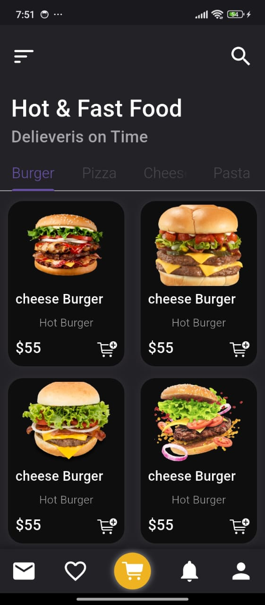
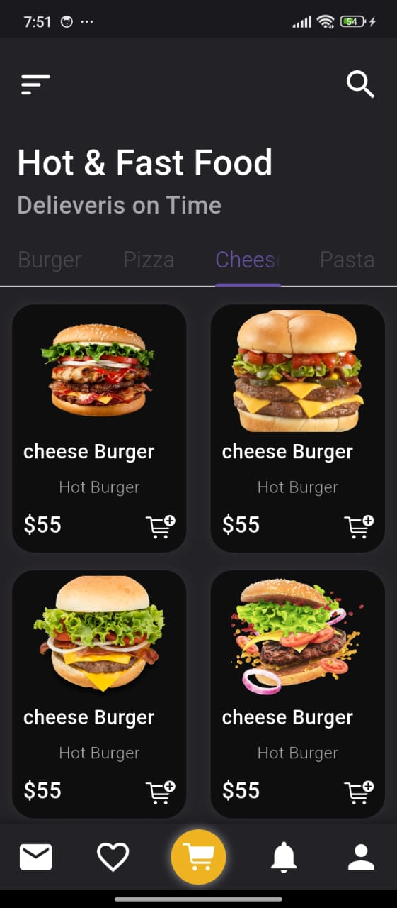
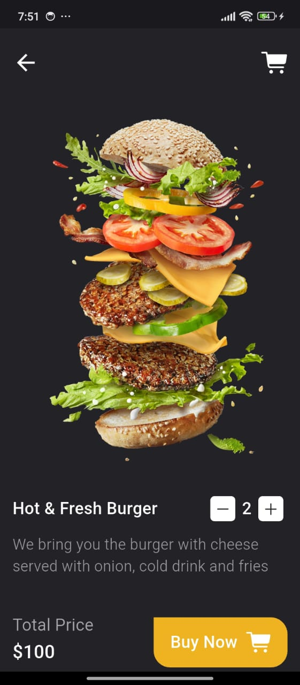

# 🍔 Awesome Food App UI Design in Flutter

This repository showcases a Flutter-based UI design for a food delivery app, demonstrating a clean and modern interface suitable for food ordering applications.

## 📸 Screenshots





*Home Screen showcasing featured restaurants and dishes.*


*Detailed view of a selected restaurant with menu items.*

## 🚀 Getting Started

To explore or modify this UI design:

1. **Clone the repository:**
   ```bash
   git clone https://github.com/AbdelrhmanAhmed200/Awesome-Food-App-UI-Design-In-Flutter.git
